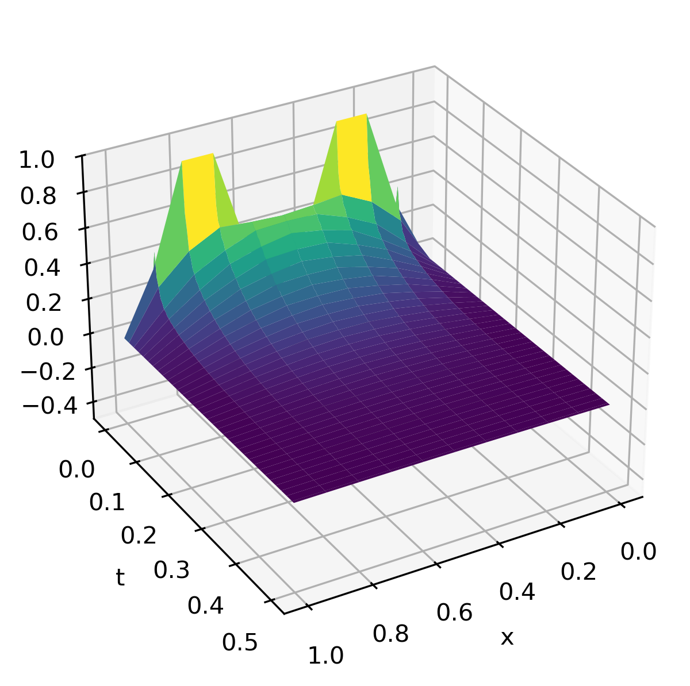

# Heat Equation Solver

### Overview

A small API that provides functions for numerically solving the 1D heat equation using the forward difference method.

### Installation

To install the package locally, run the following code in your terminal:

```
git clone https://github.com/matilda-stoetzer/heat-api.git
cd heat-api
pip install .
```

### Usage

Once installed, the API can be used to create an instance of the class `HeatEquation` to represent the equation to be solved. Then the class `ForwardDiff` is used to solve the equation numerically with forward differences.

#### Example

To solve the equation:

```math
\begin{cases}
\frac{\partial u}{\partial t}-\frac{\partial^{2}u}{\partial x^{2}}=0, & 0\leq x\leq 1, \quad 0\leq t\leq 1\\
u(0,t)=0, \space u(1,t)=0& 0\leq t\leq 1\\
u(x,0)=2\sin(2\pi t), & 0\leq x\leq 1
\end{cases}
```

first create an instance of the heat equation class:

```python
from heat import *

equation = HeatEquation(
	D=1,
	f=lambda x: np.sin(2*np.pi*x)**2,
	l=lambda t: 0*t,
	r=lambda t: 0*t,
	x_int=[0,1],
	t_int=[0,0.5]
)
```

Then create an instance of the solution class:

```python
solver = ForwardDiff(
	equation,
	M=10,
	N=100,
)
```

Solve the equation and store the solution in a variable called solution:

```python
solution = solver.solve()
```

The solution can then be visualized using matplotlib.pyplot for example. 



For more details, se the [example file](example_usage.py).

### Dependencies

This API uses NumPy to handle matrix operations. In order to use the API, NumPy must be installed. 
To install NumPy, run the following code in your terminal:

````
pip install numpy
````

More about NumPy: [numpy.org](https://numpy.org).

### License

This project is licensed under the MIT License. See the [LICENSE](LICENSE) file for details.